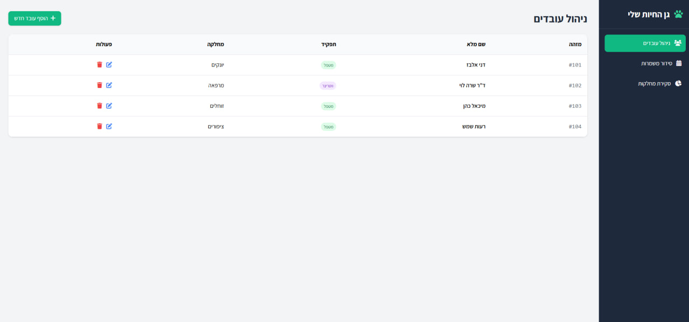
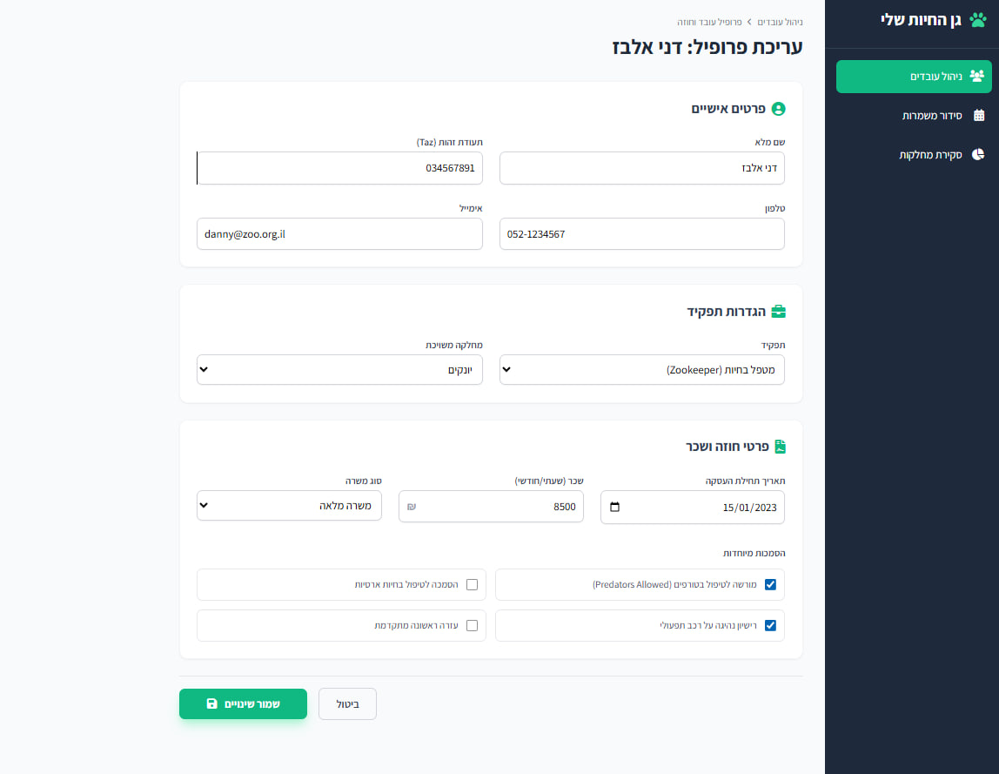
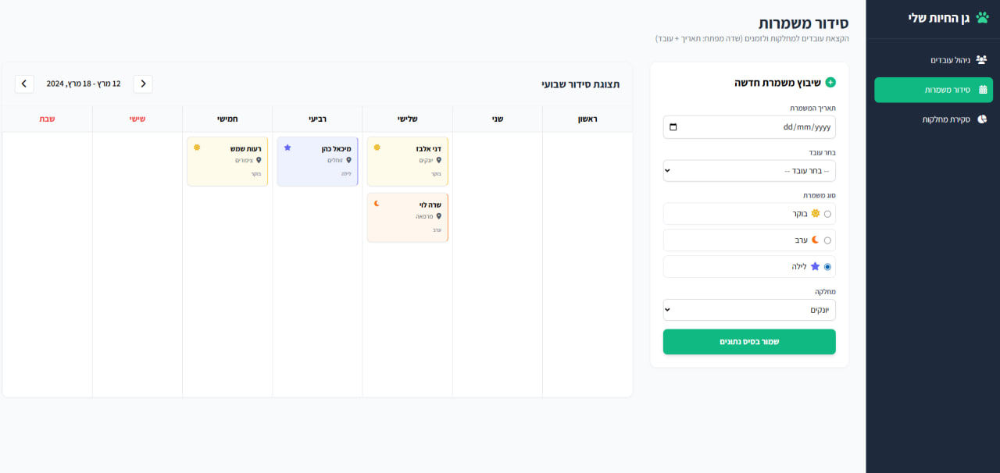
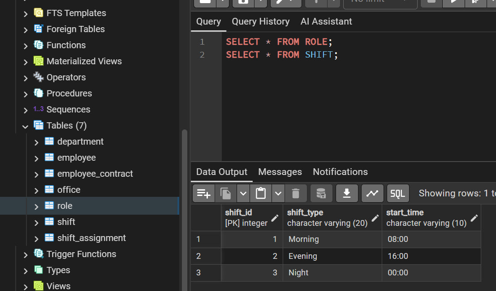
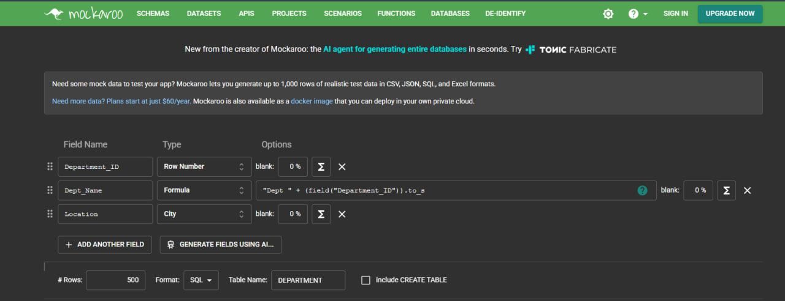
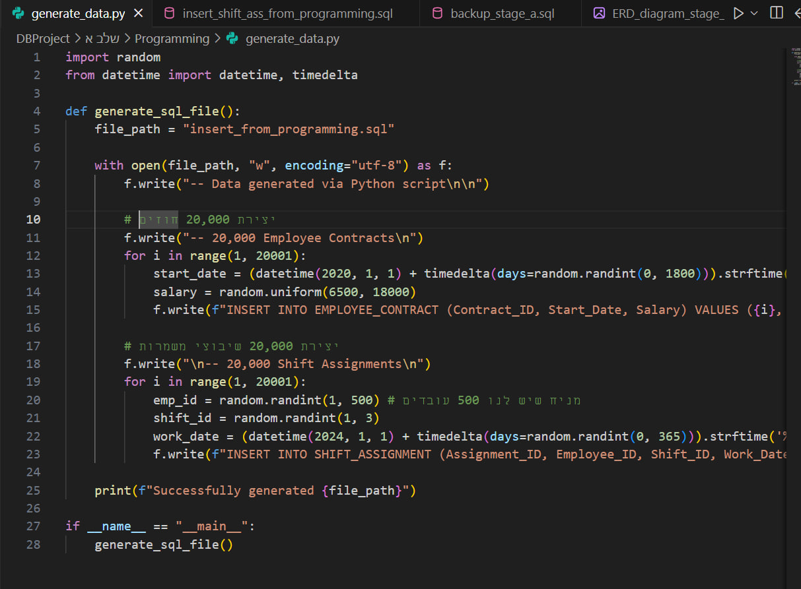
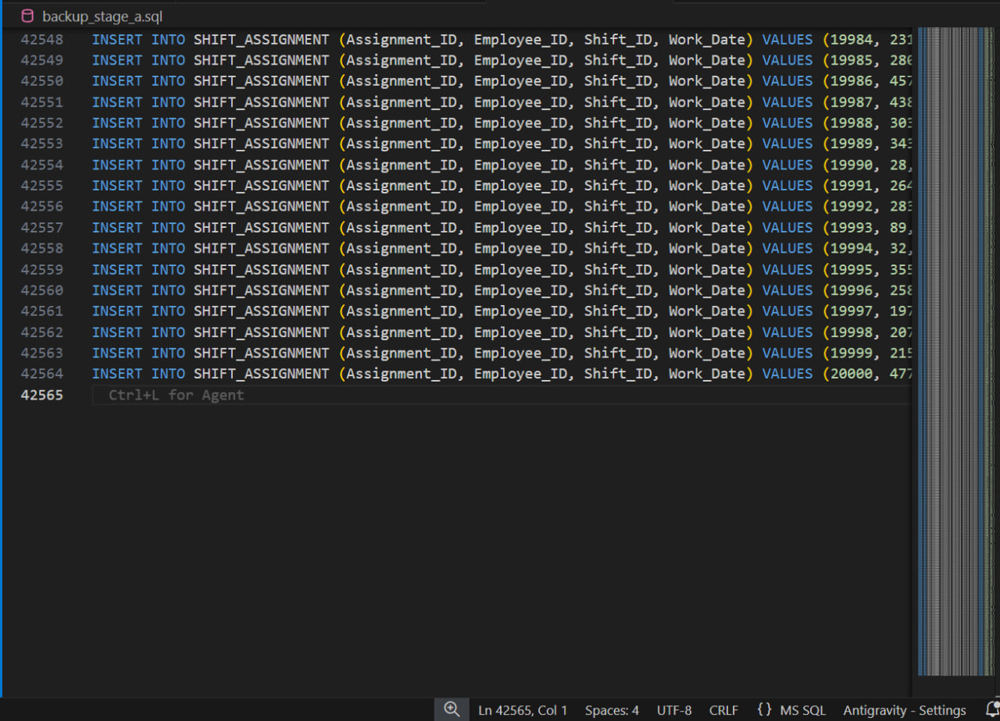

# דוח פרויקט: מערכת ניהול סגל גן חיות (Staff Management System) - שלב א'

## שער
**מגישים:** איתן איכר, אסף יהב

**מערכת:** ניהול משאבי אנוש ושיבוץ עובדים  
**היחידה הנבחרת:** ניהול סגל גן החיות ומשמרות עבודה  

---

## תוכן עניינים
1. [מבוא ותיאור המערכת](#מבוא-ותיאור-המערכת)
2. [ממשק המערכת (AI Generated)](#ממשק-המערכת)
3. [מודל נתונים (ERD & DSD)](#מודל-נתונים)
4. [החלטות עיצוב](#החלטות-עיצוב)
5. [אכלוס נתונים (3 שיטות)](#אכלוס-נתונים)
6. [גיבוי](#גיבוי)

---

## מבוא ותיאור המערכת
מערכת זו נועדה לנהל את כוח האדם בגן חיות מורכב. המערכת עוקבת אחרי עובדים, מחלקות (כגון זוחלים, יונקים, אדמיניסטרציה), תפקידים מקצועיים, וחוזים אישיים. 
**פונקציונליות עיקרית:**
* ניהול חוזי העסקה ושכר לטווח ארוך.
* שיבוץ עובדים למשמרות (בוקר/ערב/לילה) בהתאם למחלקות.
* ניהול משרדים ומיקומים פיזיים בתוך הגן.

---

## ממשק המערכת
להלן המסכים שעוצבו בעזרת AI המדגימים את חוויית המשתמש המתוכננת לניהול גן החיות. הממשק מתממשק לוגית עם הטבלאות שהקמנו בבסיס הנתונים:

### 1. מסך ניהול עובדים (טבלת EMPLOYEE)
תצוגת רשימה המרכזת את כל עובדי הגן, המחלקות והתפקידים שלהם. מסך זה מאפשר הוספה, עריכה ומחיקה של עובדים.

### 2. מסך עריכת פרופיל וחוזה (טבלאות EMPLOYEE & EMPLOYEE_CONTRACT)
פירוט מלא של פרטי העובד, כולל שיוך למחלקה ותפקיד, וניהול נתוני שכר ותנאי העסקה (הסמכות מיוחדות). הפרדה זו משקפת את החלטת העיצוב שלנו להפריד את נתוני החוזה מהעובד.

### 3. מסך סידור משמרות (טבלת SHIFT_ASSIGNMENT)
ממשק לשיבוץ שבועי של עובדים למשמרות בוקר, ערב ולילה לפי מחלקות. המערכת מוודאת כי עובד משובץ למחלקה המתאימה לו.

---

## מודל נתונים
### תרשים ERD (Entity Relationship Diagram)
תרשים הישויות והקשרים המציג את הלוגיקה העסקית.

### תרשים DSD (Data Structure Diagram)
תרשים המבנה הפיזי בבסיס הנתונים (טבלאות, סוגי נתונים ומפתחות).

---

## החלטות עיצוב
1. **הפרדת חוזים (Contract):** בחרנו להפריד את נתוני החוזה מטבלת העובד כדי לאפשר היסטוריית חוזים ושינויי שכר בעתיד ללא דריסת נתוני העובד.
2. **מפתח מורכב בשיבוצים:** טבלת `SHIFT_ASSIGNMENT` מקשרת בין עובד למשמרת ספציפית בתאריך נתון, מה שמאפשר גמישות מקסימלית בשיבוץ.
3. **שדה טלפון ייחודי:** הוספנו אילוץ ייחודי על טלפון העובד למניעת כפילויות במערכת.

---

## אכלוס נתונים
בפרויקט זה בוצע אכלוס של מעל 40,000 רשומות באמצעות שלוש שיטות:

### 1. הכנסה ידנית (Manual SQL)
הכנסת נתונים בסיסיים לבדיקת תקינות המפתחות.

### 2. שימוש ב-Mockaroo (API/Data Generator)
ייצור 500 רשומות לכל טבלה (עובדים, מחלקות, תפקידים וכו') עם נתונים דמויי מציאות.

### 3. שימוש ב-Python (Programming Method)
כתיבת סקריפט Python המייצר 20,000 חוזים ו-20,000 שיבוצי משמרות אקראיים ותקינים לוגית.

---

## גיבוי
### גיבוי נתונים
ביצוע גיבוי מלא למסד הנתונים לקובץ `backup_stage_a.sql`.

